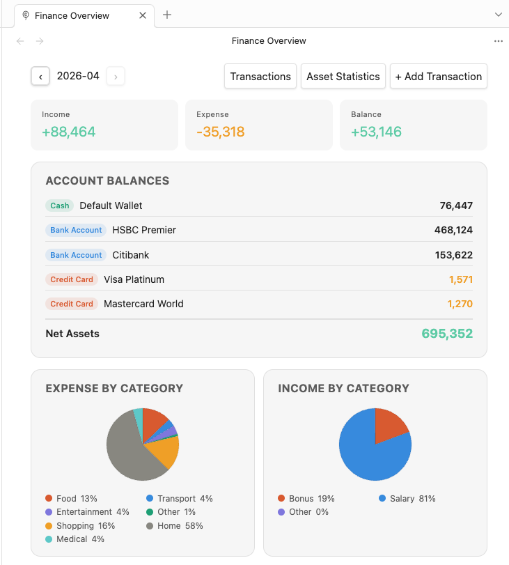
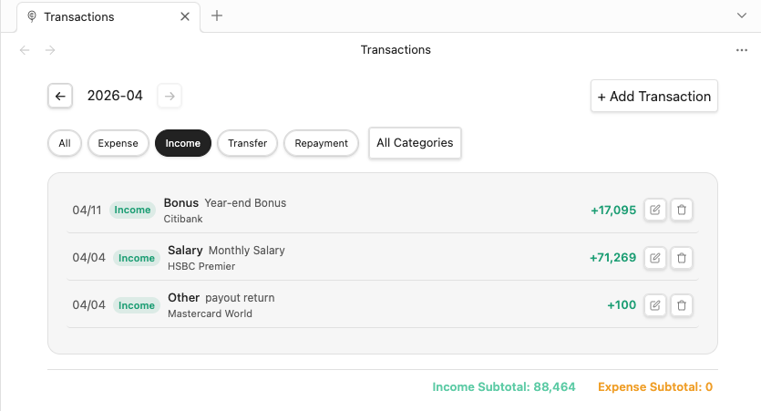
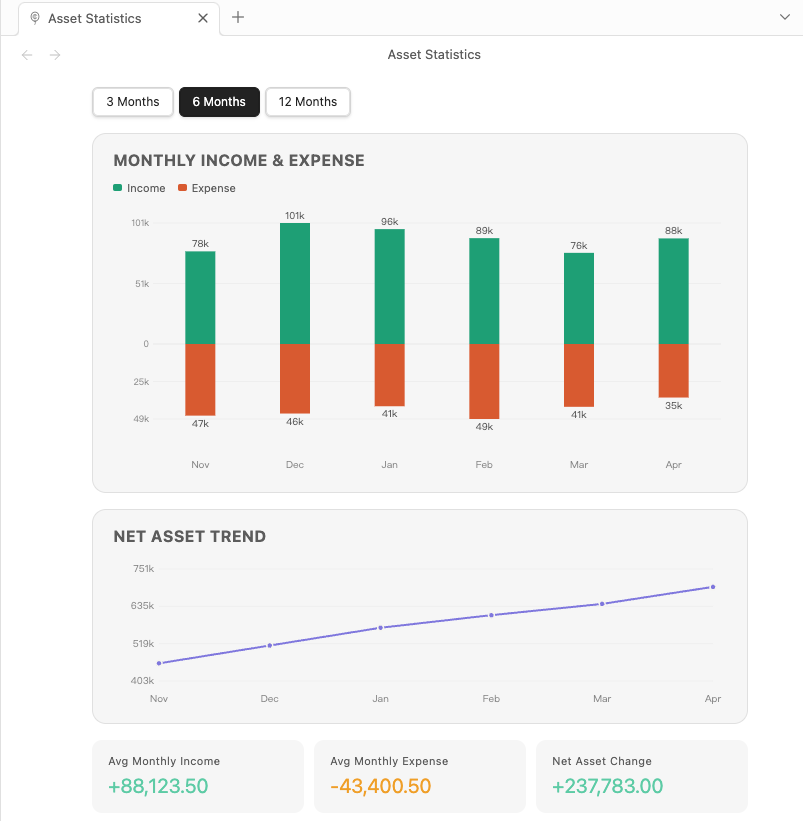
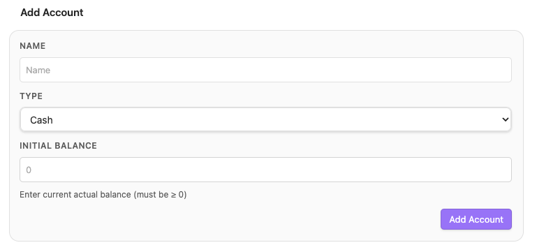
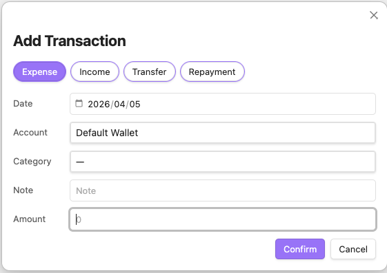
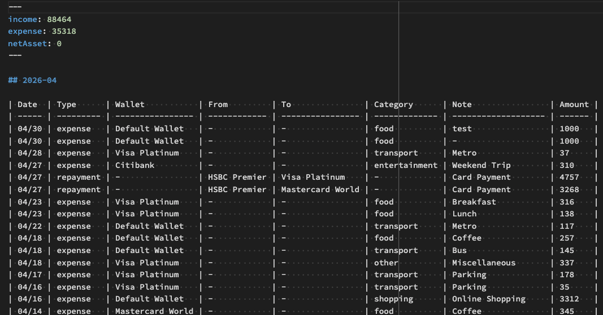

# PennyWallet

A personal finance tracker plugin for [Obsidian](https://obsidian.md). Log expenses, income, transfers, and credit card repayments — all stored as plain Markdown tables in your vault.

**Documentation:** [English](https://twrusstw.github.io/penny-wallet/) · [繁體中文](https://twrusstw.github.io/penny-wallet/zh/)

## Features

- **Finance Overview** — monthly income / expense summary, account balances, net asset, asset allocation, and category pie charts
- **Transactions** — multi-select type filter, category checklist, keyword search, inline edit and delete, with sticky subtotals
- **Finance Trends** — 3 / 6 / 12-month income/expense bar chart, category trend, net asset line chart, and per-account balance trend
- **Multiple account types** — cash, bank account, credit card (with debt tracking)
- **Custom categories** — add your own expense and income categories
- **iOS Shortcuts support** — add transactions via URI without opening Obsidian
- **Bilingual** — English and Traditional Chinese (follows Obsidian language setting)

## Installation

### Manual

1. Download `main.js`, `manifest.json`, `styles.css` from the [latest release](https://github.com/twrusstw/penny-wallet/releases/latest)
2. Copy them to `<vault>/.obsidian/plugins/penny-wallet/`
3. Enable the plugin in **Settings → Community Plugins**

### Community Plugin Store

Search **PennyWallet** in **Settings → Community Plugins → Browse**.

## Getting Started

1. Enable PennyWallet — a wallet icon appears in the left ribbon
2. Open **Settings → PennyWallet** and add your accounts with their current balances ([Settings guide](https://twrusstw.github.io/penny-wallet/settings) · [中文說明](https://twrusstw.github.io/penny-wallet/zh/settings))
3. Click the ribbon icon or run **Add Transaction** from the Command Palette to log your first entry

## Transaction Types

| Type | Description |
|------|-------------|
| **Expense** | Money out from cash / bank / credit card |
| **Income** | Money received into an account |
| **Transfer** | Move money between two accounts |
| **Repayment** | Pay off a credit card balance from a bank / cash account |

Credit card accounts track outstanding debt. Expenses increase the debt; repayments reduce it. Net asset calculation automatically subtracts credit card debt.

## Views

### Finance Overview

Monthly summary with income, expense, balance, account balances, net asset, asset allocation pie (cash/bank), and expense/income category pie charts. Each pie legend shows name, amount, and percentage.



### Transactions

Full transaction list with multi-select type filter, category checklist dropdown, keyword search, inline edit and delete. Header and subtotals stay fixed while the list scrolls.



### Finance Trends

Income/expense bar chart, category spending trend (select any category), net asset line chart, and per-account balance trend — all with a 3 / 6 / 12-month range selector.



### Settings

Add, edit, or archive accounts. Manage custom expense and income categories.



## Transaction Modal



## URI Handler

PennyWallet registers the `obsidian://penny-wallet` URI scheme, allowing external apps — including iOS Shortcuts — to open the transaction form with fields pre-filled.

```
obsidian://penny-wallet?type=expense&amount=280&category=food&note=Lunch
```

Supported parameters: `type`, `amount`, `note`, `category`, `wallet`, `fromWallet`, `toWallet`, `date`.

→ [Full URI Handler & iOS Shortcuts guide](https://twrusstw.github.io/penny-wallet/uri-handler)

## Data Format

Transactions are stored as Markdown tables, one file per month:

```
<vault>/
├── .penny-wallet.json     ← config (accounts, categories, settings)
└── PennyWallet/
    ├── 2026-04.md
    └── 2026-03.md
```



Each file has a frontmatter cache (`income`, `expense`, `netAsset`) for fast loading, and a plain Markdown table of transactions. The format is compatible with Git sync and Dataview queries.

## License

[MIT](LICENSE)
